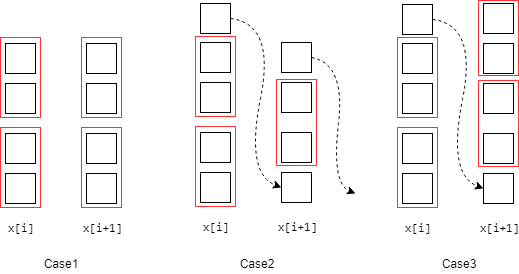

# [Array Partition I](https://leetcode.com/problems/array-partition-i/)

## Difficulty

Easy

## Tags

Array

## Description

Given an array of **2n** integers, your task is to group these integers into n pairs of integer, say (a<sub>1</sub>, b<sub>1</sub>), (a<sub>2</sub>, b<sub>2</sub>), ..., (a<sub>n</sub>, b<sub>n</sub>) which makes sum of min(a<sub>i</sub>, b<sub>i</sub>) for all i from 1 to n as large as possible.

**Example 1:**

<pre style="font-family: consolas">
<b>Input:</b> [1, 4, 3, 2]
<b>Output:</b> 4

<b>Explanation:</b> n is 2, and the maximum sum of pairs is 4 = min(1, 2) + min(3, 4).
</pre>

**Note:**
- n is a positive integer, which is in the range of [1, 10000].
- All the integers in the array will be in the range of [-10000, 10000].

## Analysis

At first sight, you may wonder that what an easy problem it is. All we need to do is sort this array and fetch every other element from 0. In this manner, however, we get a time complexity of `O(nlogn)`, assuming that the number of array is `n`, because we have to sort the array. After that, we may think a linear method to calculate the sum.

Therefore, we use buckets `b[0..i..n]` to store the elements. `x[i]` is the element and `b[i]` is the count of this element, because we notice that if the count of an element is odd, the remaining one element have to participate the comparison to next elements. Hence, we use a `flag` to record whether the count of last element is odd or even. If flag is odd, then in the next element, we have
```
sum[i + 1] = sum[i] + (x[i] + ((b[i + 1] - 1) / 2) * x[i + 1]
```
because `x[i + 1]` has to contribute one element to compare with `x[i]`. And when flag is even, we have
```
sum[i + 1] = sum[i] + (x[i] + (b[i + 1] / 2) * x[i + 1]
```
And then we need to check `b[x + 1]` to set the flag.

The cases are shown in the figure below:


- Time Complexity: `O(n)`
- Space Complexity: `O(n)`
